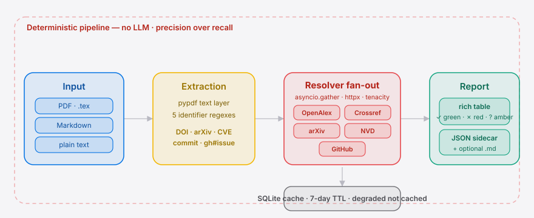

<p align="right"><a href="./README.en.md">English</a> | <strong>简体中文</strong></p>

<p align="center">
  
</p>

<p align="center">
  <a href="LICENSE"></a>
  <a href="https://pypi.org/project/citeguard/"></a>
  <a href="https://github.com/SuperMarioYL/citeguard/actions"></a>
  
  
</p>

<p align="center">
  
</p>

> **CiteGuard 是一条命令行工具，把一份论文 / bug report 里出现的所有引用（参考文献、DOI、arXiv ID、CVE、commit SHA）一次性核验到 OpenAlex / Crossref / arXiv / NVD / GitHub —— 10 秒内回一张红绿表。**

---

## 目录

- [它是为谁做的](#它是为谁做的)
- [为什么是现在](#为什么是现在)
- [安装](#安装)
- [30 秒上手](#30-秒上手)
- [演示](#演示)
- [工作原理](#工作原理)
- [配置项](#配置项)
- [输出格式](#输出格式)
- [v0.1 范围之外](#v01-范围之外)
- [路线图](#路线图)
- [GitHub Action（v0.2 新）](#github-actionv02-新)
- [开发](#开发)
- [License](#license)
- [致谢](#致谢)

---

## 它是为谁做的

| 你是 | 你的痛点 | CiteGuard 为你做什么 |
| :--- | :--- | :--- |
| **期刊 / 顶会评审人** | 一份投稿 30 条参考文献，挨条手查要 15–20 分钟，量上来评审体系直接崩 | 粘贴 PDF/.tex → 红条精准命中编造的引用 |
| **arXiv moderator** | 政策已经把"含未核查 LLM 错误"列为禁投触发条件，但工具是空白 | desk-reject 通道前置批处理，5 分钟落地 |
| **OSS 安全维护者** | Linus 形容 Linux 安全列表"几乎无法管理"——bug report 里的 CVE / commit 看着像真的、其实是编的 | 一条命令把 bug-report.md 喂进去，红条标出所有伪造 ID |
| **本科论文 / 学位论文导师** | 学生用 LLM 写的论文里夹着幻觉引用，逐条核验不现实 | 投稿前自检，标红即必须修 |

## 为什么是现在

三个解锁同时发生，2024 年前没有任何一方能独立做出来：

1. **需求侧爆点已过临界**——arXiv 2026-05 政策直接把"伪造引用"列为一年禁投的触发条件（[原贴 640 upvotes / 69 评论](https://www.reddit.com/r/MachineLearning/)）；Linus 在 LKML 上点名安全列表"几乎无法管理"。两条独立证据指向同一个动作。
2. **Registry API 第一次够用**——OpenAlex 2024 全量开放、NVD JSON 2.0、arXiv API、Crossref REST、GitHub REST 的延迟和配额第一次进入"实时"区间。2 年前 OpenAlex 还不存在。
3. **抽取层第一次便宜**——从 PDF/.tex 里抽出结构化引用，过去需要 GROBID/anystyle 这种工程团队，今天 ≤200 行确定性正则覆盖 90% 召回。CiteGuard v0.1 不引入 LLM，**精度优先**。

> 三者缺一，CiteGuard 在两年前都无法成立——这是它现在才出现的原因。

##  架构

<p align="center">
  <picture>
    <source media="(prefers-color-scheme: dark)" srcset="./assets/atlas-dark.svg">
    <source media="(prefers-color-scheme: light)" srcset="./assets/atlas-light.svg">
    
  </picture>
</p>

一条确定性、无 LLM 的流水线：文档先经**抽取层**（`pypdf` + 5 类标识符正则）拆出 DOI / arXiv / CVE / commit SHA / `owner/repo#issue`，再由 **Resolver fan-out** 用 `asyncio.gather` 并发命中五个权威 registry（`httpx` 复用连接、`tenacity` 退避重试）。**SQLite 缓存**落在 `~/.cache/citeguard`、TTL 7 天，degraded 结果刻意不入缓存以免一次瞬态故障锁死一周。最终**报告层**用 `rich` 渲染红绿表，并同步落一份 schema 稳定的 JSON 边车供下游脚本消费。

## 安装

```bash
pipx install citeguard
```

或 `pip install citeguard`。Python ≥ 3.11，无 GPU / 无后台 daemon / 无 LLM 调用，跑在 Linux 和 macOS。

## 30 秒上手

```bash
citeguard paper.pdf
```

10 秒内得到一张终端红绿表：

- ✓ **绿勾**：identifier 在权威 registry 里命中（带 evidence URL）
- ✗ **红叉**：找不到 + 给出最多 3 个最接近候选（含编辑距离）
- ? **黄问号**：超时 / 限流 / 受其它瞬态故障影响

同时落一份 `paper.pdf.citeguard.json` 给上游脚本消费。

<details>
<summary>样例输出（终端）</summary>

```
  ┌──┬──────────┬───────────────────────────────┬──────────┬────────────────────────────────────┐
  │  │ Kind     │ Identifier                    │ Registry │ Evidence / nearest match           │
  ├──┼──────────┼───────────────────────────────┼──────────┼────────────────────────────────────┤
  │✓ │ arxiv    │ 1706.03762                    │ arxiv    │ https://arxiv.org/abs/1706.03762   │
  │✗ │ arxiv    │ 9999.00001                    │ arxiv    │                                    │
  │✗ │ doi      │ 10.9999/not-a-real-doi-12345  │ openalex │ ≈ Probably-similar paper (d=23)    │
  │? │ cve      │ CVE-2024-77777                │ nvd      │ rate-limit; retry with backoff     │
  └──┴──────────┴───────────────────────────────┴──────────┴────────────────────────────────────┘
  1 hit · 2 miss · 1 degraded
```

</details>

##  演示

> 撤稿 arXiv 论文 → 红条精准命中编造引用 → 干净论文全绿 → 自动落 JSON 边车。


> 📼 `docs/demo.tape` 是 [VHS](https://github.com/charmbracelet/vhs) 脚本，CI 会自动重录 `assets/demo.gif`；本地可 `vhs docs/demo.tape` 一键重录。

## 工作原理

```
+----------+    +---------+    +------------------+    +----------+
|  输入    | -> | 抽取层  | -> |  Resolver fanout | -> |  报告层  |
| pdf/tex  |    | regex + |    |  5 个 resolver   |    | rich /   |
| md/text  |    | pypdf   |    |  httpx + 退避    |    | json/md  |
+----------+    +---------+    +--------+---------+    +----------+
                                        |
                                  +-----v------+
                                  | sqlite     |
                                  | 缓存 7d TTL|
                                  +------------+
```

1. **抽取层** 用 `pypdf` 拿 PDF 文本 + 5 类 identifier 正则。不调用 LLM，宁可漏报也不误报红条。
2. **Resolver fan-out** 用 `asyncio.gather` 并发跑五个 resolver，`tenacity` 退避到 3 次，`httpx` 单连接复用。
3. **SQLite 缓存** 落在 `~/.cache/citeguard/registry.db`，TTL 7 天；degraded 结果**不**写缓存，避免一次瞬态故障锁死一周。
4. **报告层** 用 `rich` 渲染红绿表；同步落 `.citeguard.json` 给 desk-reject pipeline 消费，可选 `--md` 落 Markdown。

## 配置项

CiteGuard 大部分行为通过命令行控制；当前**没有**配置文件——刻意保持小到一行装得下。

| 选项 | 类型 | 默认值 | 含义 |
| :--- | :--- | :--- | :--- |
| `--json PATH` | 路径 | `<input>.citeguard.json` | JSON 边车写入路径 |
| `--md PATH` | 路径 | *无* | 额外输出 Markdown 报告 |
| `--no-cache` | flag | `false` | 跳过 SQLite 缓存（每次都打真实 registry） |
| `--strict` | flag | `false` | 任一 miss 即退出码 1，给 CI 用（已被 `--fail-on` 取代，向后兼容保留） |
| `--changed-only PATH` | 路径 | *无* | **v0.2 CI 模式**：从 PATH 读 changed-file 列表，只核验里面的文件 |
| `--fail-on {none,miss,degraded}` | enum | `none` | **v0.2 CI 模式**：哪种状态计入失败 |
| `--max-misses N` | int | `0` | **v0.2 CI 模式**：容忍 N 个 miss 才触发 `--fail-on` |
| `--paths "<glob>,<glob>"` | string | `**/*.pdf,**/*.tex,**/*.md` | **v0.2 CI 模式**：以逗号分隔的 glob 过滤 changed files |
| `--summary-out PATH` | 路径 | *无* | **v0.2 CI 模式**：把 Markdown job summary 追加写到 PATH（CI 里通常是 `$GITHUB_STEP_SUMMARY`） |
| `GITHUB_TOKEN` | env | *无* | 给 GitHub resolver 用，把配额从 60/小时提到 5000/小时 |

## 输出格式

JSON 边车的 schema 稳定，下游脚本可直接消费：

```json
{
  "generator": "citeguard/0.8.0",
  "results": [
    {
      "citation": {"raw_text": "arXiv:1706.03762", "kind": "arxiv", "identifier": "1706.03762"},
      "status": "hit",
      "registry": "arxiv",
      "evidence_url": "https://arxiv.org/abs/1706.03762",
      "nearest_matches": []
    }
  ]
}
```

## v0.1 范围之外

刻意不做的事（每条都有具体理由）：

- Web UI / hosted SaaS —— v0.1 完全 CLI
- 多用户 / 鉴权 / 团队面板
- **LLM 抽取**——v0.1 只用确定性正则；任何 LLM 调用一律屏蔽（精度优先）
- 自动评审 / 引用情感判断 / 写作建议（CiteGuard 只回答"存在与否"）
- PDF OCR（仅吃带文本层的 PDF / .tex / .md / 纯文本）
- 自训练模型 / 任何需要 GPU 的功能

> v0.2 起 **GitHub Action 打包** 不再 out-of-scope —— 见下方 [GitHub Action（v0.2 新）](#github-actionv02-新)。GitLab CI 集成、SARIF 输出、自动修复编造引用仍属 v0.2 范围之外。

## GitHub Action（v0.2 新）

把 CiteGuard 放进 CI——每个 PR 自动核验引文与标识符，红条直接显示在 PR 评论上。

把下面这段拷进你的仓库 `.github/workflows/citeguard.yml`（也可以直接抄
[`examples/citeguard-action.yml`](./examples/citeguard-action.yml)）：

```yaml
name: CiteGuard

on:
  pull_request:
    types: [opened, synchronize, reopened]
    paths: ["**/*.pdf", "**/*.tex", "**/*.md"]

permissions:
  contents: read
  pull-requests: write   # sticky 评论 + inline annotation 必须

jobs:
  citeguard:
    runs-on: ubuntu-latest
    steps:
      - uses: actions/checkout@v5
        with:
          fetch-depth: 0
      - uses: SuperMarioYL/citeguard@v0.8.0
        with:
          fail-on: miss        # journals: keep miss；OSS: 起步可设 none
          max-misses: 0
          paths: "**/*.pdf,**/*.tex,**/*.md"
          comment: "true"
```

合并后，每个改 `.pdf` / `.tex` / `.md` 的 PR 都会自动跑：

1. **Sticky PR 评论**：一条自动更新的红绿表评论；标记为 `<!-- citeguard:sticky -->`，edit-in-place 不刷屏。
2. **Job summary**：同一张表写进 `$GITHUB_STEP_SUMMARY`，Actions 运行页直接可见。
3. **Inline annotation**：每个 miss / degraded 在 PR `Files changed` 标签上渲染成行内红条 / 黄条。

### 退出码契约（CLI 侧，v0.2 §2b）

`citeguard --changed-only ...` 的退出码是 v0.2 起的稳定契约——GitHub Action 依赖它：

| 退出码 | 含义 | CI 行为 |
| :---: | :--- | :--- |
| `0` | 所有引用在 `--fail-on` + `--max-misses` 阈值内（pass） | check 通过 |
| `1` | miss / degraded 计数越过阈值 | 仅当 `fail-on != none` 时 check 失败 |
| `2` | 用法 / IO 错误（坏参数、文件读不到） | check 始终失败 |

完整 inputs / outputs / 安全权限说明见 [`docs/github-action.md`](./docs/github-action.md)。

### 选阈值

| 场景 | 推荐设置 | 理由 |
| :--- | :--- | :--- |
| 期刊 / 顶会评审 | `fail-on: miss`, `max-misses: 0` | 直接卡住带编造引用的投稿 |
| OSS 文档 / 灰度铺开 | `fail-on: none` | 仅贴评论，绝不挂 PR；适合前 1–2 周观察期 |
| 关键安全公告 | `fail-on: degraded`, `max-misses: 0` | 凡是 registry 没核出的都失败，含瞬态超时 |

## 路线图

- [x] **m1 — 抽取层**：DOI / arXiv / CVE / commit SHA / `owner/repo#issue`，PDF + LaTeX + Markdown + 纯文本
- [x] **m2 — Resolver 编排**：5 个 registry 并发 + 退避 + SQLite 缓存
- [x] **m3 — 报告渲染**：红绿表 + JSON / Markdown + nearest match
- [x] **m4 — CLI CI 模式**（v0.2）：`--changed-only` / `--fail-on` / `--max-misses` / `--paths` + 退出码契约 + workflow-command annotation
- [x] **m5 — GitHub Action**（v0.2）：composite action.yml + PyPI 发布 + sticky PR 评论
- [ ] **m6 — GitLab CI component**（v0.3）
- [ ] **m7 — 可选 LLM 抽取 fallback**（off by default）
- [ ] **m8 — Windows pipx 二进制**

## 开发

```bash
git clone https://github.com/SuperMarioYL/citeguard.git
cd citeguard
python -m venv .venv && source .venv/bin/activate
pip install -e ".[dev]"
pytest -q                 # 首次运行会生成 tests/fixtures/sample_paper.pdf
make lint                 # ruff check + ruff format --check（v0.3 起为发布闸门）
pre-commit install --hook-type pre-push   # 把同套 lint 接到 git push 前
```

`make help` 列出全部任务（`install-dev` / `lint` / `lint-fix` / `test`）。
`.pre-commit-config.yaml` 把 ruff 挂在 `pre-push` 阶段——`git commit` 速度不变，
但 `git push` 之前会跑一遍 lint，避免 CI 当兜底。CI 同时跑一个 grep 闸门，把
所有 GitHub Actions 钉到 Node.js-24 majors（`checkout@v5` / `setup-python@v6`），
任何回退到 stale 版本的 PR 都会被红掉。

欢迎在 [Issues](https://github.com/SuperMarioYL/citeguard/issues) 区贴：

- 跑出 false positive（红条不该是红）的样例
- 跑出 false negative（编造引用没标红）的样例
- 任何 registry 的接入想法

## License

[Apache-2.0](./LICENSE)。商业 / 学术 / 个人皆免费，且无计划改变这点。

## 致谢

CiteGuard 的设计起点是一个具体的痛点：2026 年 arXiv 对含未核查 LLM 错误
（幻觉参考文献等）的论文实施一年禁投，OSS 安全维护者也被引用了不存在
CVE / commit 的 LLM 辅助 bug report 淹没。本仓库是对这个痛点的一个
确定性、无 LLM 的回应——只回答“这条引用是否真的存在”。
