[English](README.en.md) | **简体中文**

<picture>
  <source media="(max-width: 640px) and (prefers-color-scheme: dark)" srcset="assets/hero-mobile-dark.svg">
  <source media="(max-width: 640px)" srcset="assets/hero-mobile-light.svg">
  <source media="(prefers-color-scheme: dark)" srcset="assets/hero-dark.svg">
  
</picture>

**CiteGuard 从论文和问题报告中提取标识符，向对应 registry 查询，并把结果、证据链接和原文位置放到一起。**

`v0.8.0` · `Python ≥ 3.11` · `CLI + GitHub Action` · [Apache-2.0](LICENSE)

[用途](#用途) · [架构](#架构) · [安装](#安装) · [离线上手](#离线上手) · [联网核验](#联网核验与输出) · [CI](#接入-ci) · [配置](#配置) · [范围](#当前范围与后续方向)

## 用途

读到一个 DOI、arXiv ID 或 CVE 时，需要核对的不只是它看起来是否合理，还包括查询到了什么，以及它出现在原文哪里。CiteGuard 将这一步变成可以批量执行、保留记录的命令行流程，适合论文作者、评审人和处理问题报告的维护者。

核验结果回答标识符是否在相应 registry 中找到。它不判断论文是否支持某个论点，也不能仅凭一次 `miss` 认定作者编造了引用。格式、上下文和 registry 状态都值得继续检查。

## 架构

<picture>
  <source media="(max-width: 640px) and (prefers-color-scheme: dark)" srcset="assets/architecture-mobile-dark.svg">
  <source media="(max-width: 640px)" srcset="assets/architecture-mobile-light.svg">
  <source media="(prefers-color-scheme: dark)" srcset="assets/architecture-dark.svg">
  
</picture>

[抽取层](src/citeguard/extract.py) 读取文本层 PDF、TeX、Markdown 或纯文本，用确定性规则识别 DOI、arXiv、CVE、带前缀的 commit SHA 和 GitHub issue/PR 引用。`Citation` 保存原始匹配文本、规范化标识符、文件、字符区间和行号。

[CLI 编排](src/citeguard/cli.py) 将标识符交给对应 resolver，最多并发处理 8 条。DOI 先查 OpenAlex；只有它返回 `miss` 时才回退到 Crossref。Crossref 不可达时保留 `degraded`，不会把未经确认的缺失结果缓存下来。

[SQLite 缓存](src/citeguard/resolvers/__init__.py) 默认保留 7 天，`degraded` 不入缓存。缓存读写发生 SQLite 错误时，流程继续使用查询结果或重新查 registry。网络核验后的 `VerifyResult` 交给[报告层](src/citeguard/report.py)，生成终端表、JSON 和可选 Markdown。

## 安装

需要 Python 3.11 或更新版本；先用 `python3 --version` 检查环境。下面从源码安装：

```bash
git clone https://github.com/SuperMarioYL/citeguard.git
cd citeguard
python3 -m venv .venv
source .venv/bin/activate
python -m pip install -e .
```

安装依赖需要网络。抽取不调用模型或 registry；完整核验需要访问外部 registry。

## 离线上手

先创建一份完整输入。这里的标识符用于演示抽取，未在此示例中查询其存在性：

```bash
mkdir -p examples
cat > examples/identifiers.md <<'CITEGUARD_INPUT'
Research note
DOI: 10.1145/3460120.
arXiv:1706.03762v2
CVE-2024-3094
commit 0123456789abcdef0123456789abcdef01234567
https://github.com/example/project/issues/42
Repeat: arXiv:1706.03762
CITEGUARD_INPUT
```

运行 v0.8.0 的实际可用调用形式：

```bash
citeguard examples/identifiers.md extract examples/identifiers.md
```

v0.8.0 的命令组会先解析顶层 `PATH`，所以这里把路径写在 `extract` 前后各一次。直接执行 `citeguard extract examples/identifiers.md` 会被误解析为未知子命令。上述调用进入现有抽取实现，无需改源码。

<picture>
  <source media="(max-width: 640px) and (prefers-color-scheme: dark)" srcset="assets/process-mobile-dark.svg">
  <source media="(max-width: 640px)" srcset="assets/process-mobile-light.svg">
  <source media="(prefers-color-scheme: dark)" srcset="assets/process-dark.svg">
  
</picture>

输出为 5 个去重后的 `Citation` 对象。arXiv 版本后缀被移除，重复的 arXiv ID 合并；每个对象保留匹配行号。实际标准输出为：

```json
[
  {"raw_text":"DOI: 10.1145/3460120.","kind":"doi","identifier":"10.1145/3460120","context_span":{"file":"examples/identifiers.md","start":14,"end":35,"line":2}},
  {"raw_text":"arXiv:1706.03762v2","kind":"arxiv","identifier":"1706.03762","context_span":{"file":"examples/identifiers.md","start":36,"end":54,"line":3}},
  {"raw_text":"CVE-2024-3094","kind":"cve","identifier":"CVE-2024-3094","context_span":{"file":"examples/identifiers.md","start":55,"end":68,"line":4}},
  {"raw_text":"commit 0123456789abcdef0123456789abcdef01234567","kind":"commit","identifier":"0123456789abcdef0123456789abcdef01234567","context_span":{"file":"examples/identifiers.md","start":69,"end":116,"line":5}},
  {"raw_text":"https://github.com/example/project/issues/42","kind":"gh_issue","identifier":"example/project#42","context_span":{"file":"examples/identifiers.md","start":117,"end":161,"line":6}}
]
```

另有两个可复制的边界示例：

| 输入 | 实际调用 | 本次输出 |
|---|---|---|
| [规范化示例](examples/normalized.tex) | `citeguard examples/normalized.tex extract examples/normalized.tex` | 2 个标识符；DOI 大小写与 arXiv 版本归一后去重 |
| [匹配边界示例](examples/boundaries.txt) | `citeguard examples/boundaries.txt extract examples/boundaries.txt` | DOI 与 GitHub issue；裸 40 位哈希未被当作 commit |

[完整输入、命令和输出](docs/demo-results.json) · [创建输入并重放的脚本](docs/demo.sh) · [文本记录](docs/demo-output.txt)

## 联网核验与输出

输入准备好后，完整核验使用顶层命令。选项放在输入路径前：

```bash
citeguard --json report.json --md report.md examples/identifiers.md
```

| 状态 | 含义 | 接下来查看什么 |
|---|---|---|
| `hit` | 查询的 registry 返回了对应记录 | `evidence_url` 与原文上下文 |
| `miss` | 查询路径未找到对应记录 | 标识符格式、registry 选择，以及可用的近似候选 |
| `degraded` | 超时、限流、缺少上下文等导致无法判定 | `note` 中的具体原因 |

OpenAlex 的 DOI 缺失路径可附最多 3 个近似候选；它们只是进一步核对的线索。裸 commit 即使带有 `commit` 前缀能被抽取，缺少 owner/repo 仍无法核验；请在原文提供完整 GitHub commit URL。

默认完整流程写入 `<input>.citeguard.json`。JSON 包含 `generator` 和 `results`；每条结果包含 `citation`、`status`、`registry`、可选 `evidence_url`、`nearest_matches` 和 `note`。离线 `extract` 只向标准输出打印 Citation 数组，不产生核验状态。

已有联网流程的[终端录像](assets/demo.gif)和 [VHS 录制脚本](docs/demo.tape)随文保留。registry 结果取决于查询时的外部状态；本节离线示例的输出由上面的实际命令记录定义。

## 能力与接入

<picture>
  <source media="(max-width: 640px) and (prefers-color-scheme: dark)" srcset="assets/integrations-mobile-dark.svg">
  <source media="(max-width: 640px)" srcset="assets/integrations-mobile-light.svg">
  <source media="(prefers-color-scheme: dark)" srcset="assets/integrations-dark.svg">
  
</picture>

| 内容 | 当前路径 | 责任边界 |
|---|---|---|
| DOI | OpenAlex，`miss` 时回退 Crossref | 查询登记记录，不判断文献论证质量 |
| arXiv | arXiv API | 抽取时规范化到不带版本后缀的 ID |
| CVE | NVD | 识别并查询 CVE，不分析漏洞是否影响你的系统 |
| GitHub commit、issue/PR | GitHub REST | commit 核验需要仓库上下文 |
| PDF、TeX、Markdown、纯文本 | 文本加载与正则抽取 | PDF 需要文本层；普通无标识符的书目不保证被抽取 |
| 自动化输出 | JSON、Markdown、GitHub Action | 下游决定阈值与人工复核流程 |

## 接入 CI

仓库提供 [GitHub composite Action](action.yml)，支持 changed-file 列表、job summary、sticky PR 评论和源行 annotation。完整配置见 [Action 说明](docs/github-action.md)和[工作流示例](examples/citeguard-action.yml)。本地也可以准备同样的 changed-file 输入：

```bash
printf '%s\n' examples/identifiers.md > changed.txt
citeguard --changed-only changed.txt --fail-on miss --max-misses 0 --summary-out summary.md
```

`--fail-on none` 只生成结果；`miss` 统计缺失；`degraded` 统计缺失与无法判定的合计。超过 `--max-misses` 才失败。CI 模式退出码为 `0`（阈值内）、`1`（超过阈值）、`2`（用法或 I/O 错误）。

v0.8.0 在有 `context_span.line` 时发出精确行号的 annotation。PDF 的行号来自提取出的文本，不是页面上的视觉坐标。PR 评论需要相应仓库写权限；GitHub Action 的接入不等于本次离线示例已经在托管 CI 中运行。

## 配置

| 选项 | 默认值 / 范围 | 用途 |
|---|---|---|
| `--json PATH` | 完整流程默认 `<input>.citeguard.json` | 指定 JSON 输出 |
| `--md PATH` | 不写 Markdown | 额外输出报告 |
| `--no-cache` | 使用缓存 | 绕过缓存，重新访问 registry；并非离线模式 |
| `--strict` | 关闭 | 顶层完整流程遇到 miss 时退出 1 |
| `--changed-only PATH` | 不启用 CI 模式 | 读取每行一个路径的文件列表 |
| `--fail-on` | `none` | CI 阈值类别：none / miss / degraded |
| `--max-misses N` | `0` | CI 容许数量 |
| `--paths` | `**/*.pdf,**/*.tex,**/*.md` | CI 文件过滤 |
| `--summary-out PATH` | 不输出 | 追加 Markdown job summary |
| `--annotations / --no-annotations` | CI 模式默认开启 | 控制 workflow-command annotation |
| `GITHUB_TOKEN` | 可选 | GitHub resolver 的认证 |

当前没有配置文件。默认缓存位于 `~/.cache/citeguard/registry.db`。按 `(kind, identifier)` 去重，输出顺序遵循各 matcher 的处理顺序，不保证与全文出现顺序一致。

## 当前范围与后续方向

v0.8.0 已有五类标识符抽取、registry resolver、缓存、报告、CI 阈值、GitHub Action，以及带行号的 annotation。当前实现没有 OCR、LLM 抽取、自动修正引用、全文论证判断或托管团队界面。GitLab CI component、可选 LLM fallback 和 Windows 分发仍属于后续方向，不作为已实现能力展示。

开发命令与依赖定义见 [pyproject.toml](pyproject.toml)。项目已有 resolver、缓存与 CI 契约测试，其中 mock 用于检验分支行为，不代表真实 registry 已确认某条引用。

## 许可证

[Apache-2.0](LICENSE) · [源码与问题反馈](https://github.com/SuperMarioYL/citeguard)
